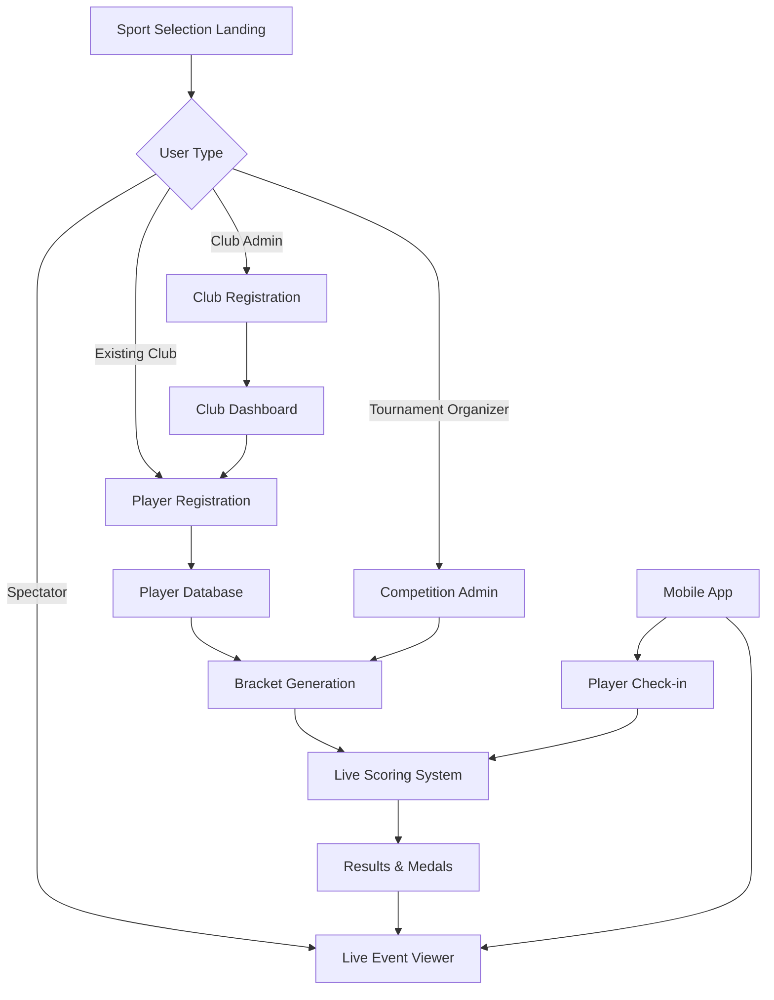

## 1. Product Overview
D-Clix Tournament Competition System (TTMS) is a futuristic web-based multi-sport tournament management platform designed for martial arts clubs, sports academies, and competition organizers. The system streamlines tournament operations from club registration to live event broadcasting, featuring real-time scoring, automated bracket generation, and comprehensive player management across 18 supported combat sports.

Target users include tournament organizers, club administrators, referees, athletes, and spectators seeking a modern, efficient competition management solution with live viewing capabilities and automated notifications.

## 2. Core Features

### 2.1 User Roles
| Role | Registration Method | Core Permissions |
|------|---------------------|------------------|
| Super Admin | Pre-configured system access | Full system control, competition setup, user management |
| Club Admin | Registration form with WhatsApp verification | Register club, submit players, view club-specific brackets and results |
| Referee/Judge | Admin assignment with credential setup | Score entry for assigned bouts, access to scoring interface |
| Timekeeper | Admin assignment | Start/stop bout timers, court management |
| Public/Spectator | No registration required | View live events, browse published brackets and results |
| Player | Club admin registration | View personal schedule, results, tournament history |

### 2.2 Feature Module
Our tournament system consists of the following main pages:
1. **Sport Selection Landing**: Welcome screen with 18 sport cards, futuristic card-based selection interface
2. **Live Event Viewer**: Real-time match tracking, bracket visualization, and medal announcements
3. **Club Registration**: Multi-step form with WhatsApp integration and digital verification
4. **Player Registration**: Sport-specific forms with category assignment and photo upload
5. **Competition Admin Dashboard**: Comprehensive tournament setup and management interface
6. **Bracket/Draw Generator**: Interactive bracket visualization with auto-seeding capabilities
7. **Real-time Scoring Interface**: Multi-judge score entry system with live updates
8. **Results & Medal Board**: Automated ranking system with certificate generation

### 2.3 Page Details
| Page Name | Module Name | Feature description |
|-----------|-------------|---------------------|
| Sport Selection Landing | Sport Selector Cards | Display 18 martial arts as interactive 3D cards with hover effects and smooth transitions |
| Sport Selection Landing | Navigation Options | Four main action buttons with futuristic glow effects and animated icons |
| Live Event Viewer | Match Tracking | Real-time score display with animated score updates and match status indicators |
| Live Event Viewer | Bracket Visualization | Interactive tournament tree with color-coded match states and auto-advancement |
| Live Event Viewer | Schedule Display | Timeline view of upcoming bouts with court assignments and countdown timers |
| Club Registration | Registration Form | Multi-step wizard with real-time validation and WhatsApp number verification |
| Club Registration | Digital Confirmation | QR code generation for club admin access and instant login credentials |
| Player Registration | Player Profile Form | Dynamic form fields based on selected sport with category auto-suggestion |
| Player Registration | Document Upload | Photo capture/ upload with automatic ID formatting and verification |
| Competition Admin | Tournament Setup | Comprehensive event configuration with drag-and-drop category management |
| Competition Admin | Draw Generation | One-click bracket creation with manual seeding override and re-generation options |
| Competition Admin | Scoring Interface | Multi-panel score entry system with real-time validation and judge coordination |
| Competition Admin | Court Management | Visual court assignment board with drag-and-drop scheduling and status tracking |
| Results Board | Medal Tally | Animated medal counter with club and country rankings and statistics |
| Results Board | Certificate Generation | Auto-generate printable PDF certificates with winner photos and digital signatures |

## 3. Core Process

### Public User Flow
1. User lands on futuristic sport selection page with animated 3D sport cards
2. Selects preferred martial art sport from glowing interactive cards
3. Chooses "Watch Live Event" from holographic-style navigation buttons
4. Views real-time tournament progress with animated bracket updates and live scores
5. Shares tournament results through social media integration

### Club Registration Flow
1. Club representative selects sport and clicks "New Club Registration"
2. Fills multi-step registration form with WhatsApp verification
3. System generates unique club ID and admin credentials
4. Club admin receives QR code and login details via WhatsApp
5. Club can immediately start registering players for competitions

### Player Registration Flow
1. Club admin logs into the futuristic portal dashboard
2. Navigates to player registration with sport-specific forms
3. Enters player details with automatic category suggestions
4. Uploads player photo with automatic ID formatting
5. System generates player QR code and registration confirmation
6. Player appears in tournament brackets automatically

### Competition Management Flow
1. Super admin creates new competition with comprehensive setup wizard
2. Configures age groups, weight classes, and tournament format
3. Generates tournament bracket with one-click auto-seeding
4. Assigns referees and timekeepers to specific courts
5. Manages real-time scoring during live matches
6. Publishes results with automated medal calculations

## 4. User Interface Design

### 4.1 Design Style
- **Primary Colors**: Deep space blue (#0A0E27), Neon cyan (#00D4FF), Electric purple (#7B3FF2)
- **Secondary Colors**: Carbon black (#1A1A1A), Titanium silver (#C0C0C0), Victory gold (#FFD700)
- **Button Style**: Holographic 3D buttons with gradient overlays and animated pulse effects
- **Typography**: Orbitron for headers, Inter for body text, with glowing text effects
- **Layout Style**: Card-based grid system with floating elements and depth-based shadows
- **Icons**: Custom 3D sport icons with metallic finishes and animated hover states
- **Animations**: Smooth parallax scrolling, particle effects, and morphing transitions

### 4.2 Page Design Overview
| Page Name | Module Name | UI Elements |
|-----------|-------------|-------------|
| Landing Page | Sport Selector | 18 floating 3D cards with sport icons, holographic hover effects, and smooth morphing animations on selection |
| Landing Page | Navigation | Four glowing orb buttons with animated icons and trailing particle effects on hover |
| Live Viewer | Score Display | Large digital scoreboard with animated number transitions and real-time updates |
| Live Viewer | Bracket View | Interactive 3D tournament tree with flowing connector lines and pulsing active matches |
| Registration Forms | Input Fields | Floating input fields with glowing borders and real-time validation feedback |
| Admin Dashboard | Control Panels | Glass-morphism panels with neon accent borders and animated status indicators |
| Scoring Interface | Score Panels | Split-screen layout with animated score entry and judge status indicators |
| Results Board | Medal Display | Animated medal icons with particle effects and rising podium visualization |

### 4.3 Responsiveness
Desktop-first design approach with full adaptive mobile optimization. Touch interaction optimization for tablet scoring interfaces and mobile app companion. Progressive web app capabilities for offline tournament viewing.

### 4.4 3D Scene Guidance
- **Environment**: Futuristic arena with holographic displays and neon lighting
- **Lighting**: Dynamic RGB lighting with pulsing effects, rim lighting on interactive elements
- **Camera**: Smooth orbital camera for 3D sport selection, fixed perspective for bracket viewing
- **Composition**: Layered depth with foreground interactive elements and background data visualizations
- **Interactions**: Gesture-based sport selection, pinch-to-zoom on brackets, swipe navigation
- **Post-processing**: Bloom effects on neon elements, depth of field for focus emphasis
- **Performance**: Optimized for 60fps with LOD systems and efficient texture management