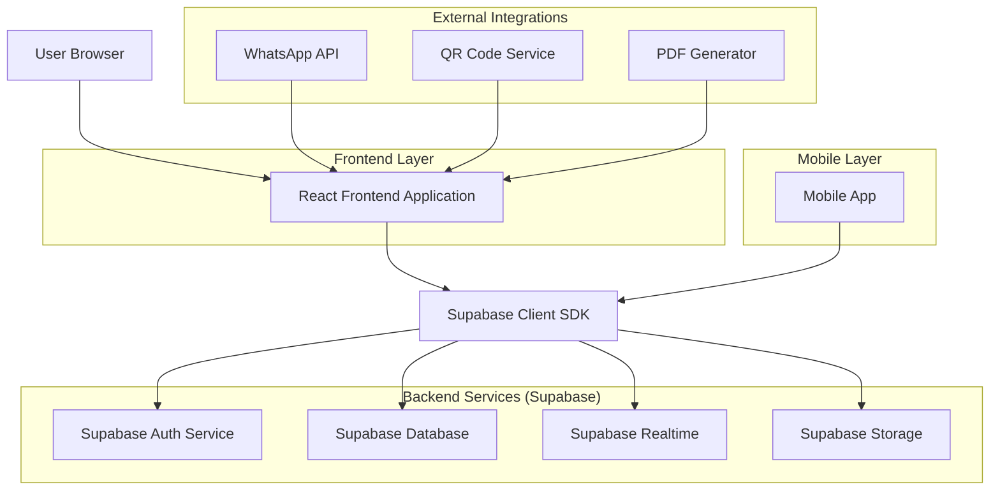
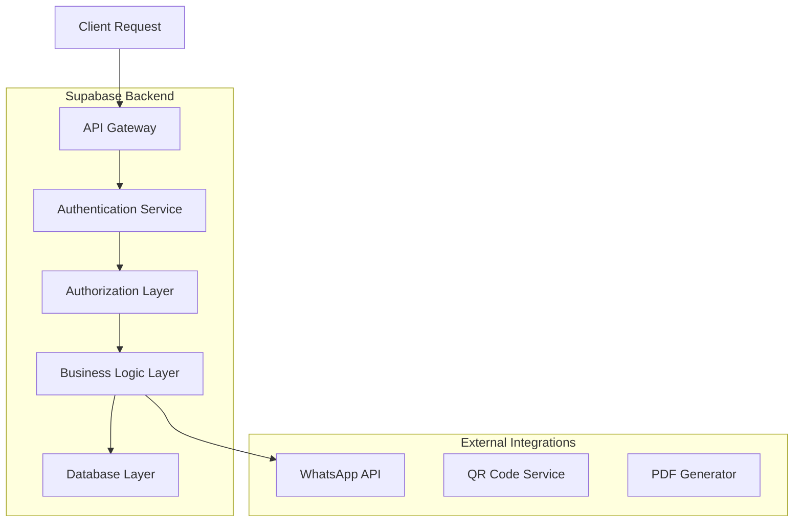
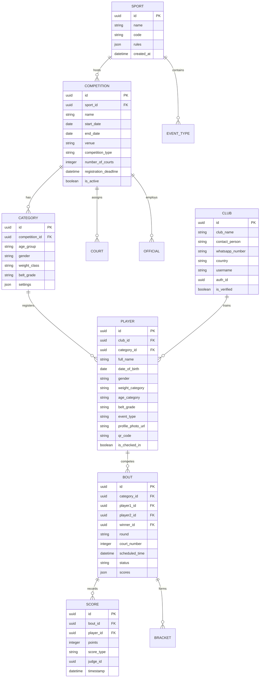

## 1. Architecture Design



## 2. Technology Description
- **Frontend**: React@18 + TypeScript + TailwindCSS@3 + Vite
- **Initialization Tool**: vite-init
- **Backend**: Supabase (PostgreSQL, Auth, Realtime, Storage)
- **State Management**: React Context + Zustand for complex state
- **UI Components**: HeadlessUI + Framer Motion for animations
- **3D Elements**: Three.js + React Three Fiber for sport selector
- **Real-time**: Supabase Realtime for live scoring updates
- **Notifications**: WhatsApp Business API integration
- **File Processing**: PDF-lib for certificate generation
- **QR Codes**: qrcode.js for player/club codes

## 3. Route Definitions
| Route | Purpose |
|-------|---------|
| / | Sport selection landing page with 3D interactive cards |
| /competition/:sport/live | Live event viewer with real-time updates |
| /competition/:sport/club/register | Club registration form with WhatsApp verification |
| /competition/:sport/player/register | Player registration with category selection |
| /competition/:sport/admin/dashboard | Main admin dashboard for tournament management |
| /competition/:sport/admin/settings | Competition setup and configuration |
| /competition/:sport/admin/categories | Age/weight/gender category management |
| /competition/:sport/admin/draw | Bracket generation and visualization |
| /competition/:sport/admin/scoring | Live scoring interface for referees |
| /competition/:sport/admin/results | Results management and medal tally |
| /competition/:sport/admin/checkin | Player check-in with QR code scanning |
| /competition/:sport/bracket/:eventId | Public bracket view (shareable) |
| /competition/:sport/player/:playerId | Player profile and tournament history |
| /competition/:sport/club/:clubId | Club dashboard with player management |
| /auth/login | Authentication page |
| /auth/register | User registration page |

## 4. API Definitions

### 4.1 Authentication APIs
```
POST /auth/v1/token
```
Request:
```json
{
  "email": "club@example.com",
  "password": "securepassword",
  "role": "club_admin"
}
```

### 4.2 Club Registration API
```
POST /rest/v1/clubs
```
Request:
```json
{
  "club_name": "Dragon Martial Arts Academy",
  "contact_person": "John Smith",
  "whatsapp_number": "+60123456789",
  "country": "Malaysia",
  "sport_id": "taekwondo",
  "username": "dragon_club"
}
```

### 4.3 Player Registration API
```
POST /rest/v1/players
```
Request:
```json
{
  "full_name": "Alex Johnson",
  "date_of_birth": "2005-03-15",
  "gender": "male",
  "weight_category": "-68kg",
  "age_category": "Junior",
  "belt_grade": "Red Belt",
  "club_id": "club_uuid",
  "sport_id": "taekwondo",
  "event_type": "kyorugi"
}
```

### 4.4 Competition Setup API
```
POST /rest/v1/competitions
```
Request:
```json
{
  "name": "National Taekwondo Championship 2024",
  "sport_id": "taekwondo",
  "start_date": "2024-06-15",
  "end_date": "2024-06-17",
  "venue": "Kuala Lumpur Sports Complex",
  "competition_type": "single_elimination",
  "number_of_courts": 4,
  "registration_deadline": "2024-05-30"
}
```

### 4.5 Live Scoring API
```
POST /rest/v1/bouts/:boutId/scores
```
Request:
```json
{
  "player1_score": 12,
  "player2_score": 8,
  "round": "quarterfinal",
  "court_number": 2,
  "referee_id": "referee_uuid",
  "timestamp": "2024-06-15T14:30:00Z"
}
```

### 4.6 Bracket Generation API
```
POST /rest/v1/competitions/:competitionId/generate-bracket
```
Request:
```json
{
  "category_id": "category_uuid",
  "seeding_type": "random",
  "manual_seeding": []
}
```

## 5. Server Architecture Diagram



## 6. Data Model

### 6.1 Data Model Definition


### 6.2 Data Definition Language

```sql
-- Sports table
CREATE TABLE sports (
    id UUID PRIMARY KEY DEFAULT gen_random_uuid(),
    name VARCHAR(100) NOT NULL UNIQUE,
    code VARCHAR(20) NOT NULL UNIQUE,
    rules JSONB,
    created_at TIMESTAMP WITH TIME ZONE DEFAULT NOW()
);

-- Competitions table
CREATE TABLE competitions (
    id UUID PRIMARY KEY DEFAULT gen_random_uuid(),
    sport_id UUID REFERENCES sports(id),
    name VARCHAR(200) NOT NULL,
    start_date DATE NOT NULL,
    end_date DATE NOT NULL,
    venue VARCHAR(300),
    competition_type VARCHAR(50) CHECK (competition_type IN ('single_elimination', 'double_elimination', 'round_robin', 'pool_system')),
    number_of_courts INTEGER DEFAULT 1,
    registration_deadline TIMESTAMP WITH TIME ZONE,
    is_active BOOLEAN DEFAULT true,
    created_at TIMESTAMP WITH TIME ZONE DEFAULT NOW()
);

-- Clubs table
CREATE TABLE clubs (
    id UUID PRIMARY KEY DEFAULT gen_random_uuid(),
    club_name VARCHAR(200) NOT NULL,
    contact_person VARCHAR(150) NOT NULL,
    whatsapp_number VARCHAR(20) NOT NULL,
    country VARCHAR(100) NOT NULL,
    username VARCHAR(50) UNIQUE NOT NULL,
    auth_id UUID REFERENCES auth.users(id),
    is_verified BOOLEAN DEFAULT false,
    created_at TIMESTAMP WITH TIME ZONE DEFAULT NOW()
);

-- Categories table
CREATE TABLE categories (
    id UUID PRIMARY KEY DEFAULT gen_random_uuid(),
    competition_id UUID REFERENCES competitions(id),
    age_group VARCHAR(50),
    gender VARCHAR(20) CHECK (gender IN ('male', 'female', 'mixed')),
    weight_class VARCHAR(100),
    belt_grade VARCHAR(100),
    settings JSONB,
    created_at TIMESTAMP WITH TIME ZONE DEFAULT NOW()
);

-- Players table
CREATE TABLE players (
    id UUID PRIMARY KEY DEFAULT gen_random_uuid(),
    club_id UUID REFERENCES clubs(id),
    category_id UUID REFERENCES categories(id),
    full_name VARCHAR(200) NOT NULL,
    date_of_birth DATE NOT NULL,
    gender VARCHAR(20) CHECK (gender IN ('male', 'female')),
    weight_category VARCHAR(100),
    age_category VARCHAR(100),
    belt_grade VARCHAR(100),
    event_type VARCHAR(100),
    profile_photo_url TEXT,
    qr_code TEXT,
    is_checked_in BOOLEAN DEFAULT false,
    created_at TIMESTAMP WITH TIME ZONE DEFAULT NOW()
);

-- Bouts table
CREATE TABLE bouts (
    id UUID PRIMARY KEY DEFAULT gen_random_uuid(),
    category_id UUID REFERENCES categories(id),
    player1_id UUID REFERENCES players(id),
    player2_id UUID REFERENCES players(id),
    winner_id UUID REFERENCES players(id),
    round VARCHAR(100),
    court_number INTEGER,
    scheduled_time TIMESTAMP WITH TIME ZONE,
    status VARCHAR(50) DEFAULT 'pending',
    scores JSONB,
    created_at TIMESTAMP WITH TIME ZONE DEFAULT NOW()
);

-- Scores table
CREATE TABLE scores (
    id UUID PRIMARY KEY DEFAULT gen_random_uuid(),
    bout_id UUID REFERENCES bouts(id),
    player_id UUID REFERENCES players(id),
    points INTEGER,
    score_type VARCHAR(100),
    judge_id UUID,
    timestamp TIMESTAMP WITH TIME ZONE DEFAULT NOW()
);

-- Create indexes for performance
CREATE INDEX idx_competitions_sport_id ON competitions(sport_id);
CREATE INDEX idx_categories_competition_id ON categories(competition_id);
CREATE INDEX idx_players_club_id ON players(club_id);
CREATE INDEX idx_players_category_id ON players(category_id);
CREATE INDEX idx_bouts_category_id ON bouts(category_id);
CREATE INDEX idx_bouts_players ON bouts(player1_id, player2_id);
CREATE INDEX idx_scores_bout_id ON scores(bout_id);

-- Enable Row Level Security
ALTER TABLE sports ENABLE ROW LEVEL SECURITY;
ALTER TABLE competitions ENABLE ROW LEVEL SECURITY;
ALTER TABLE clubs ENABLE ROW LEVEL SECURITY;
ALTER TABLE categories ENABLE ROW LEVEL SECURITY;
ALTER TABLE players ENABLE ROW LEVEL SECURITY;
ALTER TABLE bouts ENABLE ROW LEVEL SECURITY;
ALTER TABLE scores ENABLE ROW LEVEL SECURITY;

-- Create policies
CREATE POLICY "Sports are viewable by everyone" ON sports FOR SELECT USING (true);
CREATE POLICY "Competitions are viewable by everyone" ON competitions FOR SELECT USING (is_active = true);
CREATE POLICY "Clubs can view own data" ON clubs FOR SELECT USING (auth.uid() = auth_id);
CREATE POLICY "Players are viewable by everyone" ON players FOR SELECT USING (true);
CREATE POLICY "Bouts are viewable by everyone" ON bouts FOR SELECT USING (true);
CREATE POLICY "Scores are viewable by everyone" ON scores FOR SELECT USING (true);

-- Grant permissions
GRANT SELECT ON sports TO anon;
GRANT SELECT ON competitions TO anon;
GRANT SELECT ON clubs TO anon;
GRANT SELECT ON categories TO anon;
GRANT SELECT ON players TO anon;
GRANT SELECT ON bouts TO anon;
GRANT SELECT ON scores TO anon;

GRANT ALL PRIVILEGES ON sports TO authenticated;
GRANT ALL PRIVILEGES ON competitions TO authenticated;
GRANT ALL PRIVILEGES ON clubs TO authenticated;
GRANT ALL PRIVILEGES ON categories TO authenticated;
GRANT ALL PRIVILEGES ON players TO authenticated;
GRANT ALL PRIVILEGES ON bouts TO authenticated;
GRANT ALL PRIVILEGES ON scores TO authenticated;
```